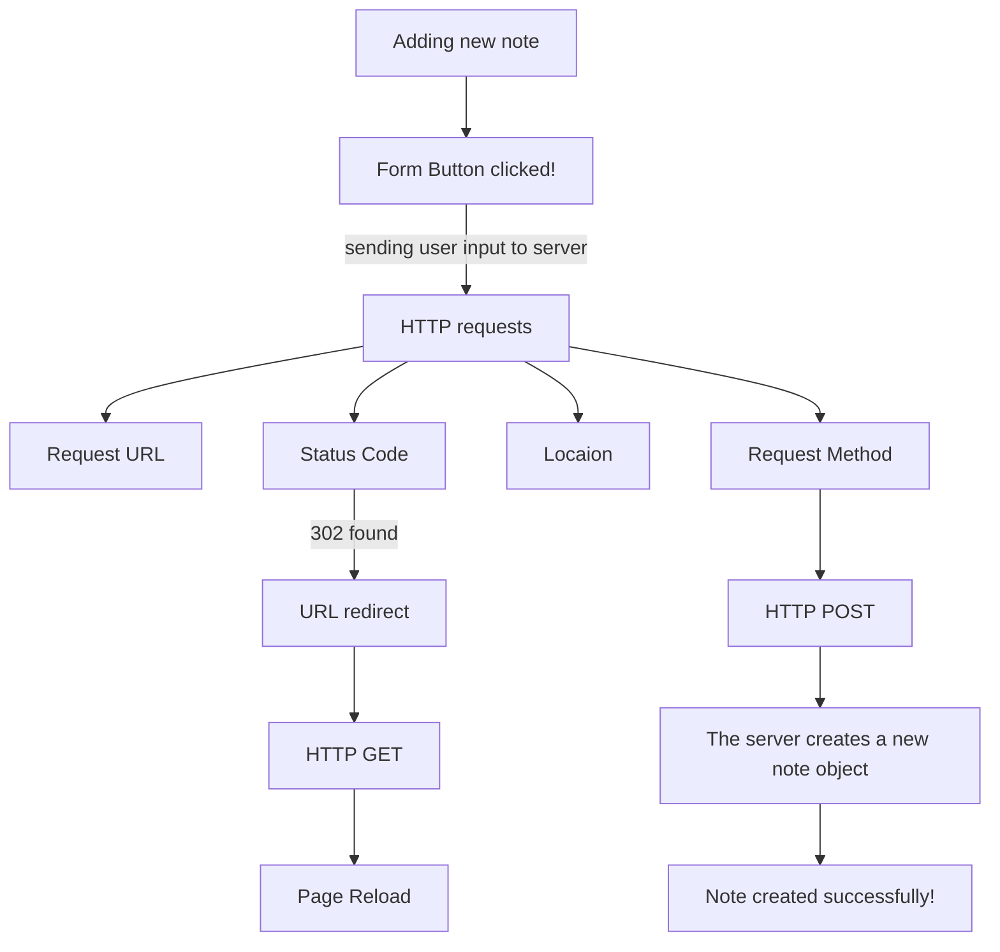

# Part0

## Exercise0.4

*Creating a new note*
---

```mermaid
flowchart TD
    A[Adding new note] --> B[Form Button clicked!]
    B --> |sending user input to server| C[HTTP requests]
    C --> E[Request URL]
    C --> F[Status Code]
    F --> |302 found|M[URL redirect]
    M --> N[HTTP GET]
    N --> O[Page Reload]
    C --> G[Locaion]
    C --> I[Request Method]
    I --> K[HTTP POST]
    K --> P[The server creates a new note object]
    P --> Q[Note created successfully!]
```