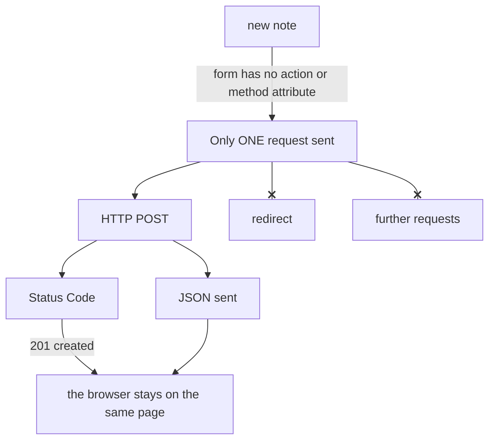

# Part0

## Exercise0.5

*Single page app*
---

```mermaid
flowchart TD
A[new note] --> |form has no action or method attribute|B[Only ONE request sent]
B --> C[HTTP POST]
B --x b[redirect]
B --x c[further requests]
C --> D[Status Code]
D --> |201 created|d[the browser stays on the same page]
C --> w[JSON sent]
w --> d
```