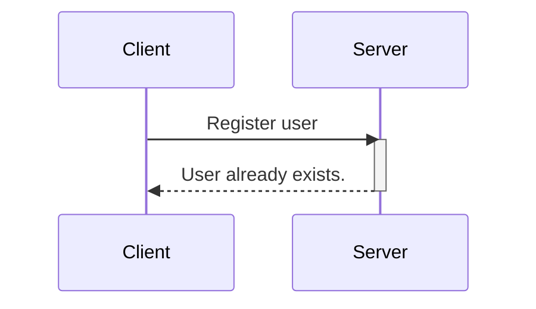
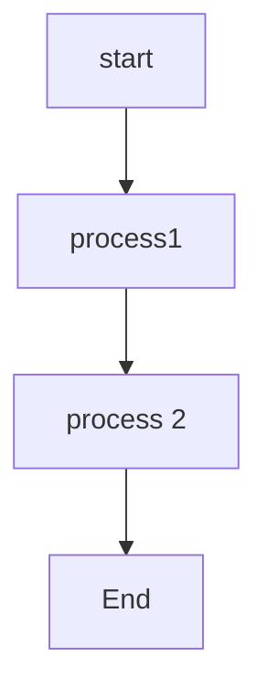

# this is a heading
<hr>

## 2nd heading
<hr>

*italic*

**bold text**

* list 
* list
* another list

>quote area

`<p>code goes here</p>
`

### Heading 3
---

```javascript
while(i< 10){
    text += "The number is" + i ;
    i++;
}
```



---

